# System Architecture Analysis

## Overview

- **Project**: /home/tom/github/oqlos/sumd
- **Primary Language**: python
- **Languages**: python: 29, shell: 5
- **Analysis Mode**: static
- **Total Functions**: 198
- **Total Classes**: 23
- **Modules**: 34
- **Entry Points**: 80

## Architecture by Module

### sumd.renderer
- **Functions**: 46
- **File**: `renderer.py`

### sumd.extractor
- **Functions**: 33
- **File**: `extractor.py`

### sumd.cli
- **Functions**: 29
- **File**: `cli.py`

### sumd.parser
- **Functions**: 23
- **Classes**: 5
- **File**: `parser.py`

### sumd.mcp_server
- **Functions**: 12
- **File**: `mcp_server.py`

### sumd.toon_parser
- **Functions**: 8
- **File**: `toon_parser.py`

### sumd.pipeline
- **Functions**: 8
- **Classes**: 1
- **File**: `pipeline.py`

### examples.llm.openai_example
- **Functions**: 3
- **File**: `openai_example.py`

### examples.llm.anthropic_example
- **Functions**: 2
- **File**: `anthropic_example.py`

### examples.mcp.mcp_client
- **Functions**: 2
- **File**: `mcp_client.py`

### sumd.sections.interfaces
- **Functions**: 2
- **Classes**: 1
- **File**: `interfaces.py`

### sumd.sections.quality
- **Functions**: 2
- **Classes**: 1
- **File**: `quality.py`

### sumd.sections.refactor_analysis
- **Functions**: 2
- **Classes**: 1
- **File**: `refactor_analysis.py`

### sumd.sections.deployment
- **Functions**: 2
- **Classes**: 1
- **File**: `deployment.py`

### sumd.sections.code_analysis
- **Functions**: 2
- **Classes**: 1
- **File**: `code_analysis.py`

### sumd.sections.metadata
- **Functions**: 2
- **Classes**: 1
- **File**: `metadata.py`

### sumd.sections.dependencies
- **Functions**: 2
- **Classes**: 1
- **File**: `dependencies.py`

### sumd.sections.call_graph
- **Functions**: 2
- **Classes**: 1
- **File**: `call_graph.py`

### sumd.sections.architecture
- **Functions**: 2
- **Classes**: 1
- **File**: `architecture.py`

### sumd.sections.source_snippets
- **Functions**: 2
- **Classes**: 1
- **File**: `source_snippets.py`

## Key Entry Points

Main execution flows into the system:

### sumd.cli.scan
> Scan a workspace directory and generate SUMD.md for every project found.

Detects projects by presence of pyproject.toml. Extracts metadata from:
pypr
- **Calls**: cli.command, click.argument, click.option, click.option, click.option, click.option, click.option, click.option

### sumd.cli.analyze
> Run analysis tools (code2llm, redup, vallm) on a project.

Installs tools to .sumd-tools/venv and generates analysis files in project/.

PROJECT: Path
- **Calls**: cli.command, click.argument, click.option, click.option, project.resolve, click.echo, click.echo, sumd.cli._setup_tools_venv

### sumd.cli.scaffold
> Generate testql scenario scaffolds from OpenAPI spec or SUMD.md.

Reads openapi.yaml (if present) and generates .testql.toon.yaml scenario files
for e
- **Calls**: cli.command, click.argument, click.option, click.option, click.option, project.resolve, None.resolve, out_dir.mkdir

### sumd.cli.generate
> Generate a SUMD document from structured format.

FILE: Path to the structured format file (json/yaml/toml)
- **Calls**: cli.command, click.argument, click.option, click.option, file.read_text, lines.append, data.get, lines.append

### sumd.pipeline.RenderPipeline._collect
> Extract all project data and build RenderContext.
- **Calls**: sumd.extractor.extract_pyproject, sumd.extractor.extract_taskfile, sumd.toon_parser.extract_testql_scenarios, sumd.extractor.extract_openapi, sumd.extractor.extract_doql, sumd.extractor.extract_pyqual, sumd.extractor.extract_python_modules, sumd.extractor.extract_readme_title

### sumd.renderer._render_test_contracts
> Render test scenarios as contract signatures — endpoint + key assertions.
- **Calls**: a, a, a, a, sorted, sc.get, None.append, by_type.items

### sumd.cli.map_cmd
> Generate project/map.toon.yaml — static code map in toon format.

Analyses all source files in the project and produces a map.toon.yaml
with module in
- **Calls**: cli.command, click.argument, click.option, click.option, click.option, project.resolve, click.echo, sumd.extractor.generate_map_toon

### sumd.cli.lint
> Validate SUMD.md files — check markdown structure and codeblock formats.

Validates:
  - Markdown structure (H1, required H2 sections, metadata fields
- **Calls**: cli.command, click.argument, click.option, click.option, sumd.cli._lint_collect_paths, sys.exit, click.echo, sys.exit

### sumd.cli.export
> Export a SUMD document to structured format.

FILE: Path to the SUMD markdown file
- **Calls**: cli.command, click.argument, click.option, click.option, sumd.parser.SUMDParser.parse_file, click.Path, click.Choice, click.Path

### examples.llm.openai_example.main
- **Calls**: argparse.ArgumentParser, parser.add_argument, parser.add_argument, parser.add_argument, parser.parse_args, Path, print, print

### examples.llm.anthropic_example.main
- **Calls**: argparse.ArgumentParser, parser.add_argument, parser.add_argument, parser.add_argument, parser.parse_args, Path, print, print

### sumd.pipeline.RenderPipeline._assemble
> Assemble all section lines into final markdown.
- **Calls**: a, a, a, self._build_registered_sections, a, a, a, a

### sumd.renderer._render_metadata_section
- **Calls**: a, a, a, a, a, openapi.get, a, a

### sumd.sections.metadata.MetadataSection.render
- **Calls**: a, a, a, a, a, ctx.openapi.get, a, a

### sumd.parser.SUMDParser._parse_header
> Parse the project header (H1).

Args:
    lines: List of document lines
- **Calls**: enumerate, line.startswith, None.strip, header_content.split, None.strip, line.startswith, len, None.strip

### sumd.cli.validate
> Validate a SUMD document.

FILE: Path to the SUMD markdown file
- **Calls**: cli.command, click.argument, sumd.parser.SUMDParser.parse_file, SUMDParser, parser.validate, click.Path, click.echo, sys.exit

### sumd.cli.extract
> Extract content from a SUMD document.

FILE: Path to the SUMD markdown file
- **Calls**: cli.command, click.argument, click.option, sumd.parser.SUMDParser.parse_file, click.Path, click.echo, sys.exit, click.echo

### examples.mcp.mcp_client.main
- **Calls**: argparse.ArgumentParser, parser.add_argument, parser.add_argument, parser.add_argument, parser.parse_args, Path, asyncio.run, sumd_path.exists

### sumd.mcp_server._tool_export_sumd
- **Calls**: sumd.mcp_server._resolve_path, arguments.get, arguments.get, sumd.parser.SUMDParser.parse_file, sumd.mcp_server._doc_to_dict, sumd.mcp_server._resolve_path, out.write_text, types.TextContent

### sumd.parser.SUMDParser._parse_sections
> Parse all sections in the document.

Args:
    lines: List of document lines
- **Calls**: line.startswith, None.strip, sections.append, None.lower, self.SECTION_MAPPING.get, Section, None.strip, sections.append

### sumd.cli.info
> Display information about a SUMD document.

FILE: Path to the SUMD markdown file
- **Calls**: cli.command, click.argument, sumd.parser.SUMDParser.parse_file, click.echo, click.echo, click.echo, click.Path, click.echo

### sumd.mcp_server._tool_generate_sumd
- **Calls**: arguments.get, data.get, data.get, None.join, section.get, sumd.mcp_server._resolve_path, out.write_text, types.TextContent

### sumd.sections.refactor_analysis.RefactorAnalysisSection.render
- **Calls**: a, a, a, a, None.replace, a, a, a

### sumd.mcp_server.list_tools
- **Calls**: server.list_tools, types.Tool, types.Tool, types.Tool, types.Tool, types.Tool, types.Tool, types.Tool

### sumd.mcp_server._tool_get_section
- **Calls**: sumd.mcp_server._resolve_path, None.lower, sumd.parser.SUMDParser.parse_file, next, types.TextContent, types.TextContent, json.dumps, s.name.lower

### sumd.mcp_server._tool_validate_sumd
- **Calls**: sumd.mcp_server._resolve_path, sumd.parser.SUMDParser.parse_file, SUMDParser, parser.validate, json.dumps, types.TextContent, len

### sumd.pipeline.RenderPipeline._build_registered_sections
> Run all registered Section classes that match the profile.
- **Calls**: PROFILES.get, set, cls, rendered.append, section.should_render, section.render

### sumd.parser._validate_deps_body
> Each line of a deps block should be a valid pip requirement or empty.
- **Calls**: enumerate, body.splitlines, line.strip, line.startswith, re.match, issues.append

### sumd.mcp_server._tool_parse_sumd
- **Calls**: sumd.mcp_server._resolve_path, sumd.parser.SUMDParser.parse_file, types.TextContent, json.dumps, sumd.mcp_server._doc_to_dict

### sumd.mcp_server._tool_info_sumd
- **Calls**: sumd.mcp_server._resolve_path, sumd.parser.SUMDParser.parse_file, len, types.TextContent, json.dumps

## Process Flows

Key execution flows identified:

### Flow 1: scan
```
scan [sumd.cli]
```

### Flow 2: analyze
```
analyze [sumd.cli]
```

### Flow 3: scaffold
```
scaffold [sumd.cli]
```

### Flow 4: generate
```
generate [sumd.cli]
```

### Flow 5: _collect
```
_collect [sumd.pipeline.RenderPipeline]
  └─ →> extract_pyproject
      └─> _read_toml
  └─ →> extract_taskfile
  └─ →> extract_testql_scenarios
```

### Flow 6: _render_test_contracts
```
_render_test_contracts [sumd.renderer]
```

### Flow 7: map_cmd
```
map_cmd [sumd.cli]
```

### Flow 8: lint
```
lint [sumd.cli]
  └─> _lint_collect_paths
```

### Flow 9: export
```
export [sumd.cli]
  └─ →> parse_file
```

### Flow 10: main
```
main [examples.llm.openai_example]
```

## Key Classes

### sumd.pipeline.RenderPipeline
> Collect project data → build sections → render → inject TOC.

Usage:
    pipeline = RenderPipeline(p
- **Methods**: 6
- **Key Methods**: sumd.pipeline.RenderPipeline.__init__, sumd.pipeline.RenderPipeline._collect, sumd.pipeline.RenderPipeline._build_registered_sections, sumd.pipeline.RenderPipeline._render_legacy_sections, sumd.pipeline.RenderPipeline._assemble, sumd.pipeline.RenderPipeline.run

### sumd.parser.SUMDParser
> Parser for SUMD markdown documents.
- **Methods**: 6
- **Key Methods**: sumd.parser.SUMDParser.__init__, sumd.parser.SUMDParser.parse, sumd.parser.SUMDParser.parse_file, sumd.parser.SUMDParser._parse_header, sumd.parser.SUMDParser._parse_sections, sumd.parser.SUMDParser.validate

### sumd.sections.interfaces.InterfacesSection
- **Methods**: 2
- **Key Methods**: sumd.sections.interfaces.InterfacesSection.should_render, sumd.sections.interfaces.InterfacesSection.render

### sumd.sections.quality.QualitySection
- **Methods**: 2
- **Key Methods**: sumd.sections.quality.QualitySection.should_render, sumd.sections.quality.QualitySection.render

### sumd.sections.refactor_analysis.RefactorAnalysisSection
- **Methods**: 2
- **Key Methods**: sumd.sections.refactor_analysis.RefactorAnalysisSection.should_render, sumd.sections.refactor_analysis.RefactorAnalysisSection.render

### sumd.sections.deployment.DeploymentSection
- **Methods**: 2
- **Key Methods**: sumd.sections.deployment.DeploymentSection.should_render, sumd.sections.deployment.DeploymentSection.render

### sumd.sections.code_analysis.CodeAnalysisSection
- **Methods**: 2
- **Key Methods**: sumd.sections.code_analysis.CodeAnalysisSection.should_render, sumd.sections.code_analysis.CodeAnalysisSection.render

### sumd.sections.metadata.MetadataSection
> Render ## Metadata — always present, all profiles.
- **Methods**: 2
- **Key Methods**: sumd.sections.metadata.MetadataSection.should_render, sumd.sections.metadata.MetadataSection.render

### sumd.sections.dependencies.DependenciesSection
- **Methods**: 2
- **Key Methods**: sumd.sections.dependencies.DependenciesSection.should_render, sumd.sections.dependencies.DependenciesSection.render

### sumd.sections.call_graph.CallGraphSection
- **Methods**: 2
- **Key Methods**: sumd.sections.call_graph.CallGraphSection.should_render, sumd.sections.call_graph.CallGraphSection.render

### sumd.sections.architecture.ArchitectureSection
- **Methods**: 2
- **Key Methods**: sumd.sections.architecture.ArchitectureSection.should_render, sumd.sections.architecture.ArchitectureSection.render

### sumd.sections.source_snippets.SourceSnippetsSection
- **Methods**: 2
- **Key Methods**: sumd.sections.source_snippets.SourceSnippetsSection.should_render, sumd.sections.source_snippets.SourceSnippetsSection.render

### sumd.sections.workflows.WorkflowsSection
- **Methods**: 2
- **Key Methods**: sumd.sections.workflows.WorkflowsSection.should_render, sumd.sections.workflows.WorkflowsSection.render

### sumd.sections.extras.ExtrasSection
- **Methods**: 2
- **Key Methods**: sumd.sections.extras.ExtrasSection.should_render, sumd.sections.extras.ExtrasSection.render

### sumd.sections.api_stubs.ApiStubsSection
- **Methods**: 2
- **Key Methods**: sumd.sections.api_stubs.ApiStubsSection.should_render, sumd.sections.api_stubs.ApiStubsSection.render

### sumd.sections.environment.EnvironmentSection
- **Methods**: 2
- **Key Methods**: sumd.sections.environment.EnvironmentSection.should_render, sumd.sections.environment.EnvironmentSection.render

### sumd.sections.configuration.ConfigurationSection
- **Methods**: 2
- **Key Methods**: sumd.sections.configuration.ConfigurationSection.should_render, sumd.sections.configuration.ConfigurationSection.render

### sumd.sections.base.Section
> Protocol for all SUMD section renderers.

Attributes:
    name:     unique identifier used in PROFIL
- **Methods**: 2
- **Key Methods**: sumd.sections.base.Section.should_render, sumd.sections.base.Section.render
- **Inherits**: Protocol

### sumd.parser.SectionType
> SUMD section types.
- **Methods**: 0
- **Inherits**: Enum

### sumd.parser.Section
> Represents a SUMD section.
- **Methods**: 0

## Data Transformation Functions

Key functions that process and transform data:

### sumd.toon_parser._parse_toon_block_config
> Extract CONFIG key-value pairs from toon file lines.
- **Output to**: re.match, re.match, line.startswith, re.match, m.group

### sumd.toon_parser._parse_toon_block_api
> Extract API endpoint rows from toon content.
- **Output to**: re.findall, None.strip, endpoints.append, int

### sumd.toon_parser._parse_toon_block_assert
> Extract ASSERT rows from toon file lines.
- **Output to**: re.match, re.match, line.startswith, re.match, rows.append

### sumd.toon_parser._parse_toon_block_performance
> Extract PERFORMANCE rows from toon file lines.
- **Output to**: re.match, re.match, line.startswith, re.match, rows.append

### sumd.toon_parser._parse_toon_block_navigate
> Extract NAVIGATE url rows from toon file lines.
- **Output to**: re.match, re.match, line.startswith, line.strip, urls.append

### sumd.toon_parser._parse_toon_block_gui
> Extract GUI action rows from toon file lines.
- **Output to**: re.match, re.match, line.startswith, re.match, actions.append

### sumd.toon_parser._parse_toon_file
> Parse a single *.testql.toon.yaml file into a scenario dict.
- **Output to**: f.read_text, content.splitlines, re.search, str, _match

### sumd.extractor._parse_doql_entities
> Parse entity blocks from DOQL content.
- **Output to**: re.finditer, dict, m.group, entities.append, re.findall

### sumd.extractor._parse_doql_interfaces
> Parse interface and integration blocks from DOQL content.
- **Output to**: re.finditer, dict, m.group, entry.update, interfaces.append

### sumd.extractor._parse_doql_workflows
> Parse workflow blocks from DOQL content, deduplicated by name.
- **Output to**: re.finditer, list, re.search, m.group, re.findall

### sumd.extractor._parse_doql_content
> Parse DOQL content from .less or .css file into structured data.
- **Output to**: re.search, re.finditer, sumd.extractor._parse_doql_interfaces, None.splitlines, dict

### sumd.cli.validate
> Validate a SUMD document.

FILE: Path to the SUMD markdown file
- **Output to**: cli.command, click.argument, sumd.parser.SUMDParser.parse_file, SUMDParser, parser.validate

### sumd.cli._render_write_validate
> Render SUMD content, write file, validate. Returns (doc, md_issues, cb_errors, cb_warnings, sources)
- **Output to**: None.run, sumd_path.write_text, sumd.parser.validate_sumd_file, sumd.parser.SUMDParser.parse_file, RenderPipeline

### sumd.cli._run_code2llm_formats
> Run code2llm for each format. Returns True if all succeeded.
- **Output to**: code2llm.exists, subprocess.run, click.echo, click.echo, str

### sumd.cli._run_tool_subprocess
> Run a single analysis tool subprocess. Returns True on success.
- **Output to**: subprocess.run, click.echo, exe.exists, click.echo, str

### sumd.mcp_server._tool_parse_sumd
- **Output to**: sumd.mcp_server._resolve_path, sumd.parser.SUMDParser.parse_file, types.TextContent, json.dumps, sumd.mcp_server._doc_to_dict

### sumd.mcp_server._tool_validate_sumd
- **Output to**: sumd.mcp_server._resolve_path, sumd.parser.SUMDParser.parse_file, SUMDParser, parser.validate, json.dumps

### sumd.renderer._render_architecture_doql_parsed
> Render parsed DOQL blocks into L (mutates in place).
- **Output to**: sumd.renderer._render_doql_app, sumd.renderer._render_doql_entities, sumd.renderer._render_doql_interfaces, sumd.renderer._render_doql_integrations

### sumd.renderer._render_quality_parsed
- **Output to**: pyqual.get, pyqual.get, pyqual.get, pyqual.get, a

### sumd.renderer._parse_calls_header
> Parse node/edge/module counts and CC average from header comments.
- **Output to**: line.startswith, line.startswith, re.search, re.search, int

### sumd.renderer._parse_calls_hubs
> Parse HUBS section into list of hub dicts.
- **Output to**: line.startswith, hubs.append, line.startswith, line.startswith, line.startswith

### sumd.renderer._parse_calls_toon
> Parse calls.toon.yaml text into structured dict for rendering.
- **Output to**: content.splitlines, sumd.renderer._parse_calls_header, sumd.renderer._parse_calls_hubs

### sumd.parser.SUMDParser.parse
> Parse a SUMD markdown document.

Args:
    content: The markdown content to parse

Returns:
    SUMD
- **Output to**: SUMDDocument, content.split, self._parse_header, self._parse_sections

### sumd.parser.SUMDParser.parse_file
> Parse a SUMD file.

Args:
    path: Path to the SUMD markdown file

Returns:
    SUMDDocument: Parse
- **Output to**: path.read_text, self.parse

### sumd.parser.SUMDParser._parse_header
> Parse the project header (H1).

Args:
    lines: List of document lines
- **Output to**: enumerate, line.startswith, None.strip, header_content.split, None.strip

## Public API Surface

Functions exposed as public API (no underscore prefix):

- `examples.mcp.mcp_client.run` - 53 calls
- `sumd.cli.scan` - 33 calls
- `sumd.cli.analyze` - 33 calls
- `sumd.cli.scaffold` - 33 calls
- `sumd.extractor.generate_map_toon` - 32 calls
- `sumd.cli.generate` - 30 calls
- `sumd.parser.validate_codeblocks` - 25 calls
- `sumd.extractor.extract_openapi` - 24 calls
- `sumd.extractor.extract_goal` - 24 calls
- `sumd.extractor.extract_dockerfile` - 22 calls
- `sumd.extractor.extract_docker_compose` - 22 calls
- `sumd.cli.map_cmd` - 20 calls
- `sumd.cli.lint` - 19 calls
- `sumd.extractor.extract_pyproject` - 17 calls
- `sumd.cli.export` - 16 calls
- `examples.llm.openai_example.main` - 15 calls
- `sumd.extractor.extract_package_json` - 15 calls
- `examples.llm.anthropic_example.main` - 14 calls
- `sumd.sections.metadata.MetadataSection.render` - 14 calls
- `sumd.extractor.extract_taskfile` - 13 calls
- `sumd.extractor.extract_env` - 13 calls
- `sumd.cli.validate` - 13 calls
- `sumd.cli.extract` - 13 calls
- `examples.mcp.mcp_client.main` - 12 calls
- `sumd.toon_parser.extract_testql_scenarios` - 12 calls
- `sumd.extractor.extract_pyqual` - 12 calls
- `sumd.extractor.extract_makefile` - 12 calls
- `sumd.extractor.extract_source_snippets` - 12 calls
- `sumd.cli.info` - 11 calls
- `sumd.sections.refactor_analysis.RefactorAnalysisSection.render` - 11 calls
- `examples.llm.openai_example.build_context` - 9 calls
- `sumd.extractor.extract_requirements` - 9 calls
- `sumd.mcp_server.list_tools` - 8 calls
- `sumd.extractor.extract_project_analysis` - 7 calls
- `sumd.parser.validate_markdown` - 6 calls
- `sumd.extractor.extract_readme_title` - 5 calls
- `sumd.mcp_server.call_tool` - 5 calls
- `sumd.parser.validate_sumd_file` - 5 calls
- `sumd.extractor.extract_python_modules` - 4 calls
- `sumd.sections.environment.EnvironmentSection.render` - 4 calls

## System Interactions

How components interact:

```mermaid
graph TD
    scan --> command
    scan --> argument
    scan --> option
    analyze --> command
    analyze --> argument
    analyze --> option
    analyze --> resolve
    scaffold --> command
    scaffold --> argument
    scaffold --> option
    generate --> command
    generate --> argument
    generate --> option
    generate --> read_text
    _collect --> extract_pyproject
    _collect --> extract_taskfile
    _collect --> extract_testql_scena
    _collect --> extract_openapi
    _collect --> extract_doql
    _render_test_contrac --> a
    _render_test_contrac --> sorted
    map_cmd --> command
    map_cmd --> argument
    map_cmd --> option
    lint --> command
    lint --> argument
    lint --> option
    lint --> _lint_collect_paths
    export --> command
    export --> argument
```



## Reverse Engineering Guidelines

1. **Entry Points**: Start analysis from the entry points listed above
2. **Core Logic**: Focus on classes with many methods
3. **Data Flow**: Follow data transformation functions
4. **Process Flows**: Use the flow diagrams for execution paths
5. **API Surface**: Public API functions reveal the interface

## Context for LLM

Maintain the identified architectural patterns and public API surface when suggesting changes.