# System Architecture Analysis

## Overview

- **Project**: /home/tom/github/oqlos/sumd
- **Primary Language**: python
- **Languages**: python: 29, md: 19, yaml: 19, json: 7, yml: 6
- **Analysis Mode**: static
- **Total Functions**: 776
- **Total Classes**: 33
- **Modules**: 90
- **Entry Points**: 628

## Architecture by Module

### project.map.toon
- **Functions**: 1530
- **File**: `map.toon.yaml`

### SUMD
- **Functions**: 336
- **Classes**: 5
- **File**: `SUMD.md`

### SUMR
- **Functions**: 143
- **Classes**: 5
- **File**: `SUMR.md`

### sumd.renderer
- **Functions**: 54
- **File**: `renderer.py`

### sumd.cli
- **Functions**: 41
- **File**: `cli.py`

### sumd.extractor
- **Functions**: 39
- **File**: `extractor.py`

### sumd.parser
- **Functions**: 24
- **Classes**: 5
- **File**: `parser.py`

### sumd.mcp_server
- **Functions**: 12
- **File**: `mcp_server.py`

### sumd.pipeline
- **Functions**: 10
- **Classes**: 1
- **File**: `pipeline.py`

### sumd.toon_parser
- **Functions**: 8
- **File**: `toon_parser.py`

### docs.USAGE
- **Functions**: 6
- **File**: `USAGE.md`

### TODO
- **Functions**: 5
- **File**: `TODO.md`

### examples.llm.openai_example
- **Functions**: 3
- **File**: `openai_example.py`

### examples.llm.anthropic_example
- **Functions**: 2
- **File**: `anthropic_example.py`

### examples.mcp.mcp_client
- **Functions**: 2
- **File**: `mcp_client.py`

### sumd.sections.base
- **Functions**: 2
- **Classes**: 2
- **File**: `base.py`

### sumd.sections.interfaces
- **Functions**: 2
- **Classes**: 1
- **File**: `interfaces.py`

### sumd.sections.refactor_analysis
- **Functions**: 2
- **Classes**: 1
- **File**: `refactor_analysis.py`

### sumd.sections.quality
- **Functions**: 2
- **Classes**: 1
- **File**: `quality.py`

### sumd.sections.deployment
- **Functions**: 2
- **Classes**: 1
- **File**: `deployment.py`

## Key Entry Points

Main execution flows into the system:

### sumd.cli.scan
> Scan a workspace directory and generate SUMD.md for every project found.

Detects projects by the presence of a known marker file (pyproject.toml,
pac
- **Calls**: cli.command, click.argument, click.option, click.option, click.option, click.option, click.option, click.option

### sumd.cli.analyze
> Run analysis tools (code2llm, redup, vallm) on a project.

Installs tools to .sumd-tools/venv and generates analysis files in project/.

PROJECT: Path
- **Calls**: cli.command, click.argument, click.option, click.option, project.resolve, click.echo, click.echo, sumd.cli._setup_tools_venv

### sumd.cli.scaffold
> Generate testql scenario scaffolds from OpenAPI spec or SUMD.md.

Reads openapi.yaml (if present) and generates .testql.toon.yaml scenario files
for e
- **Calls**: cli.command, click.argument, click.option, click.option, click.option, project.resolve, None.resolve, out_dir.mkdir

### sumd.pipeline.RenderPipeline._collect
> Extract all project data and build RenderContext.
- **Calls**: SUMR.extract_pyproject, SUMR.extract_taskfile, SUMD.extract_testql_scenarios, SUMR.extract_openapi, SUMR.extract_doql, SUMR.extract_pyqual, SUMR.extract_python_modules, SUMR.extract_readme_title

### sumd.cli.generate
> Generate a SUMD document from structured format.

FILE: Path to the structured format file (json/yaml/toml)
- **Calls**: cli.command, click.argument, click.option, click.option, file.read_text, lines.append, data.get, lines.append

### sumd.renderer._render_call_graph
> Render call graph summary from calls.toon.yaml in project_analysis.
- **Calls**: next, sumd.renderer._parse_calls_toon, a, a, a, a, a, a

### sumd.renderer._render_api_stubs
> Render OpenAPI endpoints as Python-like typed stubs for LLM orientation.
- **Calls**: openapi.get, openapi.get, a, a, openapi.get, openapi.get, a, by_tag.items

### sumd.extractor.extract_goal
> Parse goal.yaml — versioning strategy, git conventions, build strategies.
- **Calls**: goal_path.exists, yaml.safe_load, data.get, data.get, data.get, data.get, data.get, goal_path.read_text

### sumd.extractor.generate_map_toon
> Generate project/map.toon.yaml content for proj_dir.
- **Calls**: proj_dir.resolve, None.isoformat, sumd.extractor._collect_map_files, len, sum, sumd.extractor._render_map_detail, len, len

### sumd.extractor.extract_docker_compose
> Parse docker-compose*.yml — services with images, ports, environment.
- **Calls**: sorted, yaml.safe_load, services_raw.items, list, list, path.read_text, data.get, svc.get

### sumd.cli.map_cmd
> Generate project/map.toon.yaml — static code map in toon format.

Analyses all source files in the project and produces a map.toon.yaml
with module in
- **Calls**: cli.command, click.argument, click.option, click.option, click.option, project.resolve, click.echo, SUMR.generate_map_toon

### sumd.cli.lint
> Validate SUMD.md files — check markdown structure and codeblock formats.

Validates:
  - Markdown structure (H1, required H2 sections, metadata fields
- **Calls**: cli.command, click.argument, click.option, click.option, sumd.cli._lint_collect_paths, sys.exit, click.echo, sys.exit

### sumd.extractor.extract_pyproject
- **Calls**: toml_path.exists, sumd.extractor._read_toml, data.get, project.get, optional.get, None.get, project.get, project.get

### sumd.renderer._render_goal_section
- **Calls**: a, a, goal.get, goal.get, goal.get, goal.get, goal.get, a

### sumd.renderer._render_source_snippets
> Render top-N modules with function/class signatures for LLM orientation.
- **Calls**: a, a, a, a, a, a, a, a

### sumd.cli.export
> Export a SUMD document to structured format.

FILE: Path to the SUMD markdown file
- **Calls**: cli.command, click.argument, click.option, click.option, SUMR.parse_file, click.Path, click.Choice, click.Path

### examples.llm.openai_example.main
- **Calls**: argparse.ArgumentParser, parser.add_argument, parser.add_argument, parser.add_argument, parser.parse_args, Path, project.map.toon.print, project.map.toon.print

### sumd.extractor.extract_package_json
> Parse package.json — name, version, scripts, dependencies.
- **Calls**: pkg.exists, json.loads, pkg.read_text, data.get, data.get, data.get, data.get, data.get

### sumd.renderer._render_code_analysis
> Render Code Analysis section, optionally skipping files handled by other sections.
- **Calls**: a, a, set, a, a, a, a, any

### examples.llm.anthropic_example.main
- **Calls**: argparse.ArgumentParser, parser.add_argument, parser.add_argument, parser.add_argument, parser.parse_args, Path, project.map.toon.print, project.map.toon.print

### sumd.parser.SUMDParser._parse_header
> Parse the project header (H1).

Args:
    lines: List of document lines
- **Calls**: enumerate, line.startswith, None.strip, header_content.split, None.strip, line.startswith, len, None.strip

### sumd.renderer._render_test_contracts
> Render test scenarios as contract signatures — endpoint + key assertions.
- **Calls**: a, a, a, a, sorted, sc.get, None.append, by_type.items

### sumd.renderer._render_metadata_section
- **Calls**: a, a, a, a, a, openapi.get, a, a

### sumd.pipeline.RenderPipeline._assemble
> Assemble all section lines into final markdown.
- **Calls**: a, a, a, self._build_registered_sections, a, a, a, a

### sumd.sections.metadata.MetadataSection.render
- **Calls**: a, a, a, a, a, ctx.openapi.get, a, a

### sumd.extractor.extract_openapi
- **Calls**: openapi_path.exists, yaml.safe_load, data.get, list, openapi_path.read_text, data.get, None.keys, info.get

### sumd.extractor.extract_env
> Parse .env.example — return list of {key, default, comment}.
- **Calls**: None.splitlines, env_path.exists, line.strip, line_stripped.startswith, env_path.read_text, None.strip, line_stripped.partition, val_part.strip

### sumd.cli.validate
> Validate a SUMD document.

FILE: Path to the SUMD markdown file
- **Calls**: cli.command, click.argument, SUMR.parse_file, SUMDParser, parser.validate, click.Path, click.echo, sys.exit

### sumd.cli.extract
> Extract content from a SUMD document.

FILE: Path to the SUMD markdown file
- **Calls**: cli.command, click.argument, click.option, SUMR.parse_file, click.Path, click.echo, sys.exit, click.echo

### examples.mcp.mcp_client.main
- **Calls**: argparse.ArgumentParser, parser.add_argument, parser.add_argument, parser.add_argument, parser.parse_args, Path, asyncio.run, sumd_path.exists

## Process Flows

Key execution flows identified:

### Flow 1: scan
```
scan [sumd.cli]
```

### Flow 2: analyze
```
analyze [sumd.cli]
```

### Flow 3: scaffold
```
scaffold [sumd.cli]
```

### Flow 4: _collect
```
_collect [sumd.pipeline.RenderPipeline]
  └─ →> extract_pyproject
  └─ →> extract_taskfile
  └─ →> extract_testql_scenarios
```

### Flow 5: generate
```
generate [sumd.cli]
```

### Flow 6: _render_call_graph
```
_render_call_graph [sumd.renderer]
  └─> _parse_calls_toon
      └─> _parse_calls_header
      └─> _parse_calls_hubs
          └─> _process_in_hubs_line
```

### Flow 7: _render_api_stubs
```
_render_api_stubs [sumd.renderer]
```

### Flow 8: extract_goal
```
extract_goal [sumd.extractor]
```

### Flow 9: generate_map_toon
```
generate_map_toon [sumd.extractor]
  └─> _collect_map_files
      └─> _lang_of
```

### Flow 10: extract_docker_compose
```
extract_docker_compose [sumd.extractor]
```

## Key Classes

### sumd.parser.SUMDParser
> Parser for SUMD markdown documents.
- **Methods**: 6
- **Key Methods**: sumd.parser.SUMDParser.__init__, sumd.parser.SUMDParser.parse, sumd.parser.SUMDParser.parse_file, sumd.parser.SUMDParser._parse_header, sumd.parser.SUMDParser._parse_sections, sumd.parser.SUMDParser.validate

### sumd.pipeline.RenderPipeline
> Collect project data → build sections → render → inject TOC.

Usage:
    pipeline = RenderPipeline(p
- **Methods**: 6
- **Key Methods**: sumd.pipeline.RenderPipeline.__init__, sumd.pipeline.RenderPipeline._collect, sumd.pipeline.RenderPipeline._build_registered_sections, sumd.pipeline.RenderPipeline._render_legacy_sections, sumd.pipeline.RenderPipeline._assemble, sumd.pipeline.RenderPipeline.run

### sumd.sections.base.Section
> Protocol for all SUMD section renderers.

Attributes:
    name:     unique identifier used in PROFIL
- **Methods**: 2
- **Key Methods**: sumd.sections.base.Section.should_render, sumd.sections.base.Section.render
- **Inherits**: Protocol

### sumd.sections.interfaces.InterfacesSection
- **Methods**: 2
- **Key Methods**: sumd.sections.interfaces.InterfacesSection.should_render, sumd.sections.interfaces.InterfacesSection.render

### sumd.sections.refactor_analysis.RefactorAnalysisSection
- **Methods**: 2
- **Key Methods**: sumd.sections.refactor_analysis.RefactorAnalysisSection.should_render, sumd.sections.refactor_analysis.RefactorAnalysisSection.render

### sumd.sections.quality.QualitySection
- **Methods**: 2
- **Key Methods**: sumd.sections.quality.QualitySection.should_render, sumd.sections.quality.QualitySection.render

### sumd.sections.deployment.DeploymentSection
- **Methods**: 2
- **Key Methods**: sumd.sections.deployment.DeploymentSection.should_render, sumd.sections.deployment.DeploymentSection.render

### sumd.sections.code_analysis.CodeAnalysisSection
- **Methods**: 2
- **Key Methods**: sumd.sections.code_analysis.CodeAnalysisSection.should_render, sumd.sections.code_analysis.CodeAnalysisSection.render

### sumd.sections.metadata.MetadataSection
> Render ## Metadata — always present, all profiles.
- **Methods**: 2
- **Key Methods**: sumd.sections.metadata.MetadataSection.should_render, sumd.sections.metadata.MetadataSection.render

### sumd.sections.dependencies.DependenciesSection
- **Methods**: 2
- **Key Methods**: sumd.sections.dependencies.DependenciesSection.should_render, sumd.sections.dependencies.DependenciesSection.render

### sumd.sections.call_graph.CallGraphSection
- **Methods**: 2
- **Key Methods**: sumd.sections.call_graph.CallGraphSection.should_render, sumd.sections.call_graph.CallGraphSection.render

### sumd.sections.architecture.ArchitectureSection
- **Methods**: 2
- **Key Methods**: sumd.sections.architecture.ArchitectureSection.should_render, sumd.sections.architecture.ArchitectureSection.render

### sumd.sections.source_snippets.SourceSnippetsSection
- **Methods**: 2
- **Key Methods**: sumd.sections.source_snippets.SourceSnippetsSection.should_render, sumd.sections.source_snippets.SourceSnippetsSection.render

### sumd.sections.workflows.WorkflowsSection
- **Methods**: 2
- **Key Methods**: sumd.sections.workflows.WorkflowsSection.should_render, sumd.sections.workflows.WorkflowsSection.render

### sumd.sections.extras.ExtrasSection
- **Methods**: 2
- **Key Methods**: sumd.sections.extras.ExtrasSection.should_render, sumd.sections.extras.ExtrasSection.render

### sumd.sections.api_stubs.ApiStubsSection
- **Methods**: 2
- **Key Methods**: sumd.sections.api_stubs.ApiStubsSection.should_render, sumd.sections.api_stubs.ApiStubsSection.render

### sumd.sections.environment.EnvironmentSection
- **Methods**: 2
- **Key Methods**: sumd.sections.environment.EnvironmentSection.should_render, sumd.sections.environment.EnvironmentSection.render

### sumd.sections.configuration.ConfigurationSection
- **Methods**: 2
- **Key Methods**: sumd.sections.configuration.ConfigurationSection.should_render, sumd.sections.configuration.ConfigurationSection.render

### SUMR.SectionType
- **Methods**: 0

### SUMR.Section
- **Methods**: 0

## Data Transformation Functions

Key functions that process and transform data:

### SUMR._render_architecture_doql_parsed

### SUMR._render_quality_parsed

### SUMR._parse_calls_header

### SUMR._parse_calls_hubs

### SUMR._parse_calls_toon

### SUMR._parse_doql_entities

### SUMR._parse_doql_interfaces

### SUMR._parse_doql_workflows

### SUMR._parse_doql_content

### SUMR.validate

### SUMR._render_write_validate

### SUMR._run_code2llm_formats

### SUMR._run_tool_subprocess

### SUMR.parse

### SUMR.parse_file

### SUMR._validate_yaml_body

### SUMR._validate_less_css_body

### SUMR._validate_mermaid_body

### SUMR._validate_toon_body

### SUMR._validate_bash_body

### SUMR._validate_deps_body

### SUMR.validate_codeblocks

### SUMR.validate_markdown

### SUMR.validate_sumd_file

### SUMR._parse_header

## Behavioral Patterns

### recursion__walk_projects
- **Type**: recursion
- **Confidence**: 0.90
- **Functions**: sumd.cli._walk_projects

## Public API Surface

Functions exposed as public API (no underscore prefix):

- `examples.mcp.mcp_client.run` - 53 calls
- `sumd.cli.scan` - 36 calls
- `sumd.cli.analyze` - 33 calls
- `sumd.cli.scaffold` - 33 calls
- `sumd.cli.generate` - 30 calls
- `sumd.extractor.extract_goal` - 24 calls
- `sumd.extractor.generate_map_toon` - 24 calls
- `sumd.extractor.extract_docker_compose` - 22 calls
- `sumd.cli.map_cmd` - 20 calls
- `sumd.cli.lint` - 19 calls
- `sumd.extractor.extract_pyproject` - 17 calls
- `sumd.parser.validate_codeblocks` - 17 calls
- `sumd.cli.export` - 16 calls
- `examples.llm.openai_example.main` - 15 calls
- `sumd.extractor.extract_package_json` - 15 calls
- `examples.llm.anthropic_example.main` - 14 calls
- `sumd.sections.metadata.MetadataSection.render` - 14 calls
- `sumd.extractor.extract_openapi` - 13 calls
- `sumd.extractor.extract_env` - 13 calls
- `sumd.cli.validate` - 13 calls
- `sumd.cli.extract` - 13 calls
- `examples.mcp.mcp_client.main` - 12 calls
- `sumd.toon_parser.extract_testql_scenarios` - 12 calls
- `sumd.extractor.extract_pyqual` - 12 calls
- `sumd.extractor.extract_makefile` - 12 calls
- `sumd.extractor.extract_source_snippets` - 12 calls
- `sumd.sections.refactor_analysis.RefactorAnalysisSection.render` - 11 calls
- `sumd.cli.info` - 11 calls
- `sumd.extractor.extract_taskfile` - 10 calls
- `examples.llm.openai_example.build_context` - 9 calls
- `sumd.extractor.extract_requirements` - 9 calls
- `sumd.mcp_server.list_tools` - 8 calls
- `sumd.extractor.extract_project_analysis` - 7 calls
- `sumd.parser.validate_markdown` - 6 calls
- `sumd.extractor.extract_readme_title` - 5 calls
- `sumd.extractor.extract_dockerfile` - 5 calls
- `sumd.parser.validate_sumd_file` - 5 calls
- `sumd.mcp_server.call_tool` - 5 calls
- `sumd.extractor.extract_python_modules` - 4 calls
- `sumd.parser.SUMDParser.parse` - 4 calls

## System Interactions

How components interact:

```mermaid
graph TD
    scan --> command
    scan --> argument
    scan --> option
    analyze --> command
    analyze --> argument
    analyze --> option
    analyze --> resolve
    scaffold --> command
    scaffold --> argument
    scaffold --> option
    _collect --> extract_pyproject
    _collect --> extract_taskfile
    _collect --> extract_testql_scena
    _collect --> extract_openapi
    _collect --> extract_doql
    generate --> command
    generate --> argument
    generate --> option
    generate --> read_text
    _render_call_graph --> next
    _render_call_graph --> _parse_calls_toon
    _render_call_graph --> a
    _render_api_stubs --> get
    _render_api_stubs --> a
    extract_goal --> exists
    extract_goal --> safe_load
    extract_goal --> get
    generate_map_toon --> resolve
    generate_map_toon --> isoformat
    generate_map_toon --> _collect_map_files
```



## Reverse Engineering Guidelines

1. **Entry Points**: Start analysis from the entry points listed above
2. **Core Logic**: Focus on classes with many methods
3. **Data Flow**: Follow data transformation functions
4. **Process Flows**: Use the flow diagrams for execution paths
5. **API Surface**: Public API functions reveal the interface

## Context for LLM

Maintain the identified architectural patterns and public API surface when suggesting changes.